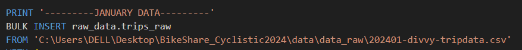
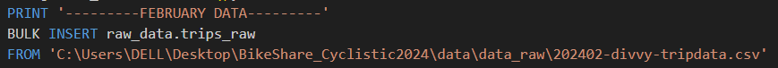

# 🚲 Cyclistic Bike-Share Analysis (2024)

## 📘 Project Overview
This repository contains the analytical project **“Cyclistic Bike-Share Analysis”**, developed as part of a data analytics case study.  
The main goal of the project was to identify behavioral differences between **annual members** and **casual riders** of the Cyclistic bike-sharing program in Chicago.

The analysis was conducted using **SQL Server** for data processing and **Power BI** for visualization.  
The project includes a full report, interactive dashboard, and reproducible SQL queries used for data exploration and insights generation.

---

## 🛠️ Tools and Technologies
- **SQL Server** – data cleaning and analysis  
- **Power BI** – dashboard creation and data visualization  
- **Misrosoft Excel** - data browsing before staring SQL processing
- **Microsoft Word** – final business report formatting  
- **GitHub** – version control and project publication  

---

## 📂 Repository Structure
| File / Folder | Description |
|----------------|-------------|
| `init_database.sql` | Initializes the Cyclistic database and creates the required schema and tables. |
| `import_raw_data_procedure.sql` | Stored procedure for importing raw monthly trip data into the database. |
| `clean_procedure.sql` | Cleans, transforms, and standardizes raw data into the curated `cleaned_data.trips_cleaned` table. |
| `data_analysis.sql` | SQL script containing all analytical queries used in the project. |
| `Cyclistic_dashboard.pbit` | Power BI dashboard template for interactive visualization of the cleaned dataset. |
| `Cyclistic_report.docx` | Final analytical report summarizing methodology, insights, and business recommendations. |
| `/data/` *(optional)* | Directory for storing cleaned datasets or sample data (excluded due to size). |
| `README.md` | Project documentation and usage guide. |

---

## 🔍 Key Insights (Summary)
The analysis revealed several behavioral differences between user types:
- **Members** ride mainly on **weekdays**, following commuting patterns.  
- **Casual riders** are more active on **weekends**, suggesting leisure or recreational usage.  
- **Members** show distinct **rush-hour peaks** (8–9 AM and 5–6 PM), while **casual riders** ride more evenly throughout the day.  
- **Casual riders** take **longer rides on average** (≈20 min) compared to members (≈12 min).  


Full discussion and rationale are included in the Word report.

---

## 💼 Business Recommendations (Brief Summary)
1. **Target weekend riders for membership conversion** – Introduce short-term or flexible membership options for weekend riders.  
2. **Leverage ride-duration differences in marketing** – Promote cost efficiency and convenience of annual memberships for frequent or long-distance riders.  
3. **Maintain balanced vehicle availability** – Ensure both electric and classic bikes are available across mixed-use zones to support all user types.  

Full discussion and rationale are included in the Word report.

---
## 📊 How to Use the Dashboard


The dashboard provides interactive views of ride behavior — including trip duration, weekday and hourly trends, vehicle type usage, and seasonal variations.

**Steps:**

1. **Download the raw data**  
   Download monthly trip data files for **January–December 2024** from the official [Divvy Tripdata repository](https://divvy-tripdata.s3.amazonaws.com/index.html).

2. **Place all files in a single folder**  
   Store the downloaded `.csv` files in one directory on your local machine (e.g. `data/data_raw/`).

3. **Adjust the import path**  
   In the `import_raw_data_procedure.sql` file, modify the file path variable (highlighted section in the screenshot below) to point to your local folder containing the `.csv` files.

   *(see image below for reference, apply for all months)*  
   
   next,
   
   and on..

4. **Run the database initialization script**

   In your SQL environment (e.g. SQL Server Management Studio):  
   - Open the file **`init_database.sql`**  
   - Execute the full script to create the **BikeShare** database, required schemas (`raw_data`, `cleaned_data`), and base tables.  
   ⚙️ *This step is only required once, when setting up the environment.*

5. **Run scripts that prepare data**

   After the database is created, execute the following stored procedures to load and clean data:

   ```sql
   EXEC import_raw_data;   -- Imports monthly CSV files into raw_data.trips_raw
   EXEC clean_data;        -- Cleans and standardizes data into cleaned_data.trips_cleaned
    ```
    ⚙️ *This step can be redone tu update data if something in csv files changes*
    
**Final steps:**
1. Download and open **`Cyclistic_dashboard.pbit`** in **Power BI Desktop**.  
2. When prompted, connect to your dataset/SQL Envirnonment (table: `cleaned_data.trips_cleaned`).  
3. Verify that the column names and data types match those used in the SQL script (it should be 1:1 match, but if visuals still don't work after step 4. verify this) 
4. Click **Refresh** to load visuals.  
5. Use the available slicers to filter by:
   - `member_casual` (user type)  
   - `rideable_type` (bike type)  
   - `month` or `season`  

---

## 📁 Data Source
- **Dataset:** [Divvy Trip Data 2024](https://divvy-tripdata.s3.amazonaws.com/index.html)  
- **Provider:** Motivate International Inc.  
- **License:** Available under the Google Data Analytics Professional Certificate program.  

---

## 🧾 Project Information
- **Author:** Piotr Paczek  
- **Date:** October 2025  
- **Location:** Kraków, Poland  
- **Last updated:** 05.10.2025  

---


### ⭐ Acknowledgment
This project is inspired by the **Cyclistic Bike-Share Case Study** from the Google Data Analytics Professional Certificate.  
Special thanks to Motivate International Inc. for providing open-access trip data.

